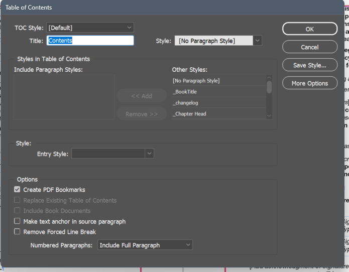

# indesign-scripting-fail
Public documentation of items that are missing, incomplete, or don't work properly in the InDesign scripting DOM

## EPub export
**book.epubExportPreferences.epubCreatePageNavigation = false** does indeed seem to set the property to false, but it has no effect on the output. The aria page navigation tags are still included in the EPUB output.

## Share For Review
None of the Share For Review functionality is present in the DOM, not even the ability to check for the presence of an Share For Review comments in the document.

## Text To Image (Beta)
None of this functionality is in the DOM as far as I know.

## Adobe InDesign Component Information
The information in the dialog that appears when you press Command+Shift+About Indesign (most importantly, the Document History) is not in the DOM.

## app.generalPreferences.objectsMoveWithPage
The documentation states that this setting only affects page objects when the page is moved via the UI. InDeed, this setting will select/deselect the option in the InDesign Control Panel, but it has no affect on page items if a page is moved via scripting. No known workarounds. Documented 2023-06-12, InDesign vs. 18.3

## textWrapPreferences.textWrapOffset
The documentation says: 
>The format for defining text wrap offset values depends on the text wrap type. If text wrap type is jump object text wrap, specify 2 values in the format [top, bottom]. If text wrap type is next column text wrap or contour, specify a single value. For bounding box text wrap, specify 4 values in the format in the format [top, left, bottom, right].

However if text wrap type is jump object, you still need to specify 4 values in the format in the format [top, left, bottom, right].

## Hyperlink Alt Text
As of 2023-06-12, InDesign vs. 18.3 (also earlier), the `Alt Text` field cannot be scripted:

## Type > Find/Replace Font
As of 2023-06-13, InDesign vs. 18.3 (also earlier), this command cannot be scripted. Possible workarounds involve scripting Find/Change routines to look for a specific font, or other scripting methods. But none of these workarounds work precisely the same what the Type > Find/Replace Font works.

## Various Preferences

Preferences > User Interface Scaling

Preferences > Type > Enable In-Menu Font Previews

Preferences > Type > Number of Recent Fonts

Preferences > Type >  Enable Japanese font preview in "find more"

Preferences > Type > Sort recent fonts list alphabetically

Preferences > Type > Preview fonts on hover

Preferences > Dictionary > Duden Dictionary > Show Hyphenation Options

Preferences > File Handling > Default Relink Folder

Preferences > File Handling > Hide New Layers When Updating or Relinking

Preferences > Clipboard Handling > Show Auto Style Option

## Various View settings

View > Extras > Show Text Threads

View > Extras > Show Assigned Frames

View > Extras > Show Hyperlinks

View > Extras > Show Link Badge

Structure Panel Menu > Show Comments

Structure Panel Menu > Show Processing Instructions

## Table of Contents options

Make text anchors in source paragraph does not have any equivalent binding in DOM. Calling Document.createTOC() will ignore this setting even if it is set in the TOC style.

Remove Forced Line Break -> same as above
